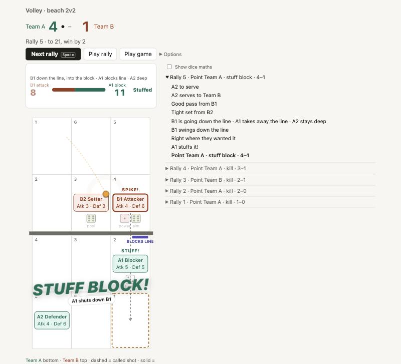

# Volley

A 2v2 beach volleyball dice game in the browser. Every touch is a dice roll: serve, pass, set, attack, block and dig. On attack you choose line, cross or tip. On defence you choose where to block and whether to dig deep or creep in for the tip. Read the other side right and you stuff the block or dig the ball; guess wrong and it's a kill. First to 21, win by 2.



## Run

```sh
npm install
npm run dev
```

Then open http://localhost:5173 and press Space to play.
